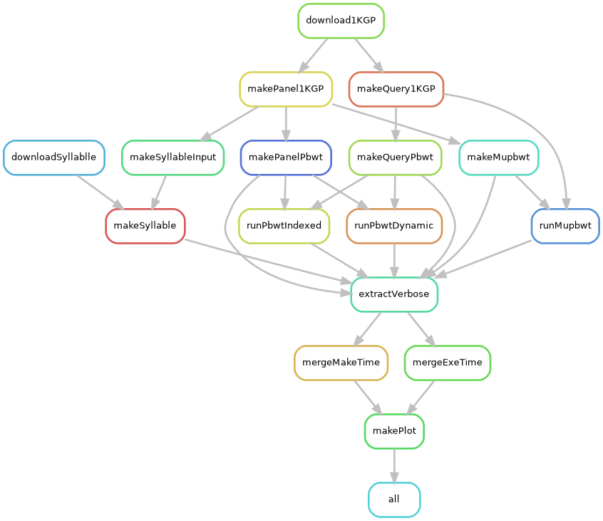

# muPBWT-1KGP-workflow

[Snakemake](https://doi.org/10.12688/f1000research.29032.1) workflow for testing 
[μ-PBWT](https://github.com/dlcgold/muPBWT) against Durbin's 
[PBWT](https://github.com/richarddurbin/pbwt) and 
[Syllable-PBWT](https://github.com/ZhiGroup/Syllable-PBWT) on 
[1000 Genome Project (1KGP) phase 3 data](https://doi.org/10.1038/nature15393).
1KGP data are available at this 
[link](https://ftp.1000genomes.ebi.ac.uk/vol1/ftp/release/20130502/).

## Prerequisite
Snakemake need to be already installed, for example via
[conda](https://bioconda.github.io/recipes/snakemake/README.html):
```shell
conda create -c conda-forge -c bioconda -n snakemake snakemake
```

## Run pipeline
```shell
cd muPBWT-1KGP-workflow
snakemake --cores <num_cores> --use-conda --resources load=100
```
The option `--resources load=100` option will avoid using too much RAM for Durbin Algorithm 5 (about 500gb is still needed), running only one job at a time for the rule `runPbwtIndexed`(thanks [Jan Schreiber](https://stackoverflow.com/questions/51977436/restrict-number-of-jobs-by-a-rule-in-snakemake)).

## Results 
The pipeline will generatecd some results:
- in `results/data` some useful CSV files
- in `results/plots` some plots in PDF format
- in `results/tables` some tables in LaTeX syntax

## Pipeline overview

